# 🤖 Parallel Agent Execution Guide

> **Comprehensive guide for coordinating 3 concurrent agents across development tracks**

This guide provides detailed instructions for implementing the revised NOFX roadmap using 3 parallel agents working on independent tracks simultaneously.

---

## 🎯 Parallel Execution Overview

### Core Philosophy

The NOFX Control Plane revision is designed for **true parallel development** where 3 agents work simultaneously on different aspects of each phase. This approach:

- **Triples Development Velocity**: Concurrent work eliminates sequential bottlenecks
- **Maximizes Agent Specialization**: Each agent focuses on their area of expertise
- **Reduces Integration Risk**: Continuous integration prevents divergence
- **Maintains Quality Standards**: Dedicated testing and validation throughout

### Agent Roles & Responsibilities

```mermaid
graph TB
    A[🤖 Agent Alpha] --> A1[Primary Infrastructure]
    A --> A2[Core Systems]
    A --> A3[Backend Services]

    B[🤖 Agent Beta] --> B1[Feature Enhancement]
    B --> B2[User Experience]
    B --> B3[Advanced Capabilities]

    C[🤖 Agent Gamma] --> C1[Integration & Testing]
    C --> C2[DevOps & CI/CD]
    C --> C3[Documentation & Quality]
```



---

## 🚀 Phase 1: Parallel Execution Plan

### Pre-Execution Setup

#### Environment Preparation
```bash
# Create parallel development environments
git worktree add -b feature/phase-1-track-a worktrees/phase-1-track-a
git worktree add -b feature/phase-1-track-b worktrees/phase-1-track-b
git worktree add -b feature/phase-1-track-c worktrees/phase-1-track-c

# Verify all worktrees are clean and ready
git worktree list
```

#### Communication Setup
- **Daily Standup Time**: 9:00 AM (15 minutes)
- **Integration Sync**: Every 2 days (30 minutes)
- **Weekly Review**: Fridays 4:00 PM (1 hour)
- **Emergency Coordination**: Slack channel #nofx-phase1-coordination

### 🤖 Agent Alpha - Track A: Agent Registry Infrastructure

#### Week 1: Database & Core APIs
**Focus**: Database schema and fundamental API structure

```bash
cd worktrees/phase-1-track-a

# Day 1-2: Database Schema
- Create migration: 20241001000001_agent_registry_tables.sql
- Implement RLS policies for agent_registry and agent_versions tables
- Add proper indexing for performance optimization
- Test schema with existing database infrastructure

# Day 3-4: Core API Endpoints
- Implement /api/agents/index.ts (list agents)
- Implement /api/agents/[id]/index.ts (get agent details)
- Add authentication integration with existing auth system
- Implement proper error handling and validation

# Day 5: Integration Testing
- Test APIs with existing infrastructure
- Validate correlation tracking integration
- Ensure observability framework captures metrics
- Run initial performance benchmarks
```

#### Week 2: Publishing & Validation Systems
**Focus**: Agent publishing and validation infrastructure

```bash
# Day 1-3: Publishing Infrastructure
- Implement /api/agents/publish.ts with Zod validation
- Create /api/agents/validate.ts for manifest validation
- Add idempotency support using existing middleware
- Implement proper audit logging

# Day 4-5: Registry Scripts
- Create scripts/registry/publishAgents.ts
- Create scripts/registry/validateAgents.ts
- Integrate with existing correlation tracking
- Add comprehensive error handling and logging
```

#### Week 3: Rollback & Advanced Features
**Focus**: Version management and advanced registry features

```bash
# Day 1-2: Version Management
- Implement /api/agents/[id]/rollback.ts
- Add version comparison and diff capabilities
- Implement proper version lifecycle management
- Add comprehensive audit trails

# Day 3-5: Advanced Features & Testing
- Add search and filtering capabilities to registry APIs
- Implement performance optimizations
- Complete comprehensive test suite
- Integration testing with Beta and Gamma tracks
```

### 🤖 Agent Beta - Track B: Template System Enhancement

#### Week 1: Template Marketplace Foundation
**Focus**: Enhance existing template system with marketplace capabilities

```bash
cd worktrees/phase-1-track-b

# Day 1-2: Marketplace Data Model
- Extend existing template database schema
- Add categorization, tagging, and rating fields
- Implement template discovery metadata
- Maintain backward compatibility

# Day 3-5: Enhanced Template APIs
- Extend /builder/templates endpoints with search/filtering
- Add template export/import functionality
- Implement bulk operations for template management
- Add enhanced version comparison capabilities
```

#### Week 2: Analytics & Advanced Features
**Focus**: Template analytics and advanced functionality

```bash
# Day 1-3: Template Analytics
- Implement usage tracking for templates
- Add performance metrics collection
- Create analytics dashboard endpoints
- Integrate with existing observability system

# Day 4-5: Advanced Template Features
- Enhanced variable validation with custom schemas
- Template dependency management system
- Multi-environment template configurations
- Template testing and validation framework
```

### 🤖 Agent Gamma - Track C: Integration & DevOps Pipeline

#### Week 1: Package Structure & CI/CD Foundation
**Focus**: Standardize package structure and establish CI/CD

```bash
cd worktrees/phase-1-track-c

# Day 1-2: Package Structure
- Create packages/shared/agents/ and packages/shared/templates/
- Define standardized directory structures
- Create template generators for new agents/templates
- Document package organization standards

# Day 3-5: CI/CD Pipeline Foundation
- Create GitHub Actions for agent validation
- Implement automated testing pipelines
- Set up integration test matrix
- Establish deployment automation
```

#### Week 2: Cross-Track Integration
**Focus**: Enable seamless integration between Alpha and Beta tracks

```bash
# Day 1-3: Integration Framework
- Create unified testing framework for both registries
- Implement cross-registry search capabilities
- Add integration monitoring and health checks
- Establish performance benchmarking

# Day 4-5: Documentation & Developer Tools
- Create comprehensive API documentation
- Implement CLI tools for development workflow
- Add VS Code extension for agent/template development
- Create contributor onboarding documentation
```

---

## 🔄 Coordination Protocols

### Daily Standups (15 minutes)

#### Agenda Template
```markdown
## Daily Standup - Phase 1 - [Date]

### 🤖 Agent Alpha (Track A: Agent Registry)
- **Completed Yesterday**: [Specific accomplishments]
- **Today's Plan**: [Specific goals]
- **Blockers**: [Any impediments]
- **Coordination Needs**: [Dependencies on other tracks]

### 🤖 Agent Beta (Track B: Template Enhancement)
- **Completed Yesterday**: [Specific accomplishments]
- **Today's Plan**: [Specific goals]
- **Blockers**: [Any impediments]
- **Coordination Needs**: [Dependencies on other tracks]

### 🤖 Agent Gamma (Track C: Integration & DevOps)
- **Completed Yesterday**: [Specific accomplishments]
- **Today's Plan**: [Specific goals]
- **Blockers**: [Any impediments]
- **Coordination Needs**: [Dependencies on other tracks]

### Cross-Track Coordination
- **Integration Points**: [Scheduled integrations for today]
- **Shared Resources**: [Database, APIs, documentation needing coordination]
- **Decisions Needed**: [Any blocking decisions requiring group input]
```

### Integration Sync (Every 2 Days - 30 minutes)

#### Purpose
- Validate API contracts between tracks
- Test cross-track integrations
- Resolve technical dependencies
- Align on shared data models

#### Process
```bash
# Integration Testing Checklist
1. Merge latest changes from all tracks to integration branch
2. Run comprehensive test suite across all tracks
3. Validate API contracts and data flow
4. Performance testing for integrated components
5. Resolve any conflicts or integration issues
6. Update shared documentation and contracts
```

### Weekly Review (Fridays - 1 hour)

#### Comprehensive Assessment
- **Progress Review**: Compare actual vs. planned progress
- **Quality Metrics**: Code coverage, performance benchmarks, security scans
- **Integration Status**: Cross-track compatibility and functionality
- **Risk Assessment**: Identify and mitigate potential issues
- **Next Week Planning**: Adjust plans based on learnings and progress

---

## 📊 Progress Tracking & Metrics

### Real-Time Dashboard Metrics

#### Development Velocity
- **Commits per Track**: Daily commit frequency by agent
- **Feature Completion**: Percentage of planned features completed
- **Test Coverage**: Code coverage percentage by track
- **Performance Benchmarks**: API response times and throughput

#### Quality Indicators
- **Build Status**: Continuous integration build health
- **Security Scans**: Vulnerability counts and severity
- **Code Quality**: Static analysis scores and technical debt
- **Documentation Coverage**: API and feature documentation completeness

#### Integration Health
- **Cross-Track Compatibility**: Integration test pass rates
- **API Contract Compliance**: Schema validation and breaking changes
- **Shared Resource Conflicts**: Database and file system conflicts
- **Dependency Resolution**: External and internal dependency health

### Success Criteria Tracking

#### Phase 1 Completion Metrics
```javascript
const phase1Metrics = {
  trackA: {
    agentRegistryAPIs: '5/5 endpoints implemented',
    databaseSchema: '100% complete with RLS',
    registryScripts: '3/3 scripts operational',
    testCoverage: '>95% achieved',
    performanceTargets: '<200ms API response time'
  },
  trackB: {
    templateEnhancements: '100% marketplace foundation',
    analyticsIntegration: 'Real-time metrics operational',
    advancedFeatures: 'All planned features implemented',
    backwardCompatibility: '100% maintained',
    userExperience: 'Enhanced discovery and management'
  },
  trackC: {
    packageStructure: 'Standardized and documented',
    cicdPipeline: 'Fully operational with automation',
    crossTrackIntegration: 'Seamless operation validated',
    documentation: 'Comprehensive and current',
    developerTools: 'CLI and VS Code extension operational'
  }
};
```

---

## 🛠️ Technical Coordination

### Shared Resource Management

#### Database Coordination
```sql
-- Coordination strategy for database changes
-- Alpha owns: agent_registry, agent_versions tables
-- Beta owns: template enhancements to existing tables
-- Gamma owns: analytics and reporting views

-- Migration naming convention:
-- 20241001_trackA_agent_registry_core.sql
-- 20241002_trackB_template_marketplace_fields.sql
-- 20241003_trackC_cross_registry_analytics.sql
```

#### API Contract Management
```typescript
// Shared type definitions
interface SharedContracts {
  // Alpha-defined contracts
  AgentRegistryAPI: {
    listAgents: () => Promise<Agent[]>;
    getAgent: (id: string) => Promise<Agent>;
    publishAgent: (manifest: AgentManifest) => Promise<PublishResult>;
  };

  // Beta-defined contracts
  EnhancedTemplateAPI: {
    searchTemplates: (query: SearchQuery) => Promise<Template[]>;
    getTemplateAnalytics: (id: string) => Promise<Analytics>;
  };

  // Gamma-defined contracts
  CrossRegistryAPI: {
    unifiedSearch: (query: string) => Promise<SearchResults>;
    getSystemHealth: () => Promise<HealthStatus>;
  };
}
```

#### Conflict Resolution Process
1. **Immediate Detection**: Automated conflict detection in CI/CD
2. **Communication**: Alert all agents immediately via Slack
3. **Resolution Meeting**: Emergency coordination call within 2 hours
4. **Priority Assignment**: Determine which track takes precedence
5. **Implementation**: Implement agreed-upon resolution
6. **Validation**: Test resolution across all tracks

---

## 🔒 Quality Assurance

### Continuous Testing Strategy

#### Track-Specific Testing
- **Alpha**: Agent registry API testing, database integration testing
- **Beta**: Template functionality testing, backward compatibility testing
- **Gamma**: Integration testing, end-to-end workflow testing

#### Cross-Track Integration Testing
```bash
# Automated integration testing pipeline
npm run test:integration:cross-track

# Manual integration validation
npm run validate:track-compatibility
npm run test:performance:integrated
npm run test:security:cross-track
```

### Code Review Process

#### Review Responsibilities
- **Alpha Reviews**: Database schemas, core API implementations
- **Beta Reviews**: Template enhancements, user experience changes
- **Gamma Reviews**: Integration code, CI/CD configurations, documentation

#### Review Standards
- **Security**: All code must pass security scanning
- **Performance**: Must meet established performance benchmarks
- **Quality**: Minimum 95% test coverage required
- **Documentation**: All public APIs must have comprehensive documentation

---

## 🚀 Phase Completion Protocol

### Pre-Completion Validation

#### Technical Validation
1. **All Tests Passing**: Unit, integration, and cross-track tests
2. **Performance Benchmarks**: Meet or exceed established targets
3. **Security Scan**: Zero critical vulnerabilities
4. **Documentation**: 100% API coverage and user guides complete

#### Integration Validation
1. **Cross-Track Functionality**: All integration points working seamlessly
2. **Data Consistency**: Database integrity across all track modifications
3. **API Compatibility**: All contracts honored and backward compatible
4. **User Experience**: End-to-end workflows function as designed

### Phase Handoff Process

#### Deliverable Package
- **Codebase**: All track code merged and tested
- **Documentation**: Complete technical and user documentation
- **Test Suite**: Comprehensive test coverage with automation
- **Performance Baselines**: Established metrics for next phase
- **Lessons Learned**: Documentation of coordination insights

#### Next Phase Preparation
- **Architecture Review**: Validate readiness for next phase requirements
- **Resource Planning**: Ensure adequate infrastructure for next phase
- **Team Coordination**: Adjust coordination processes based on learnings
- **Risk Assessment**: Identify and plan mitigation for next phase risks

---

## 📞 Support & Escalation

### Communication Channels

#### Primary Channels
- **Slack #nofx-phase1-coordination**: Daily communication and quick questions
- **Daily Standups**: Structured progress updates and coordination
- **Integration Syncs**: Technical coordination and problem-solving
- **Weekly Reviews**: Strategic planning and comprehensive assessment

#### Escalation Process
1. **Level 1**: Agent-to-agent direct communication
2. **Level 2**: Team discussion in daily standup
3. **Level 3**: Emergency coordination meeting
4. **Level 4**: Project leadership involvement

### Emergency Procedures

#### Critical Issues
- **System Down**: Immediate escalation to all agents
- **Data Loss**: Stop all development, assess scope, coordinate recovery
- **Security Breach**: Immediate notification, coordinated response
- **Integration Failure**: Emergency coordination meeting within 1 hour

#### Contact Information
- **Agent Alpha**: [Primary contact for Track A issues]
- **Agent Beta**: [Primary contact for Track B issues]
- **Agent Gamma**: [Primary contact for Track C issues]
- **Project Lead**: [Escalation contact for critical decisions]

---

*This guide ensures successful parallel execution of the NOFX Control Plane revision with maximum efficiency, quality, and coordination between agents.*