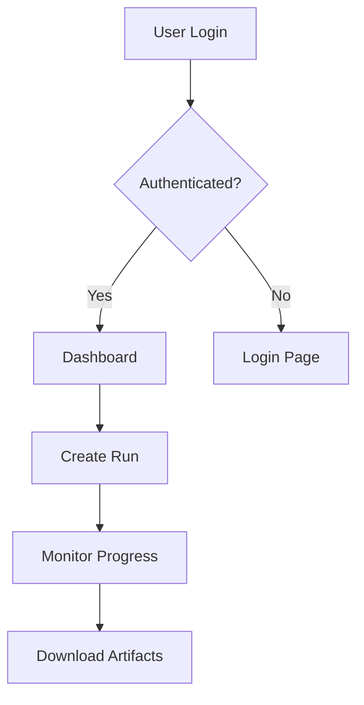

# NOFX Control Plane - Screenshots Reference Guide

## About This Guide

This document provides detailed descriptions of the web interface components shown in the main documentation. Since actual screenshots require a running instance, these ASCII art representations and descriptions help visualize the interface layout and functionality.

## How to Generate Actual Screenshots

To capture real screenshots of your NOFX Control Plane instance:

### Method 1: Using Browser Developer Tools

```bash
# 1. Start the application
npm run dev
npm run fe:dev

# 2. Open Chrome/Firefox
# 3. Press F12 to open Developer Tools
# 4. Click the device toolbar icon (Responsive Design Mode)
# 5. Set viewport to 1920x1080
# 6. Navigate through the interface
# 7. Use browser screenshot tools or extensions
```

### Method 2: Using Automated Screenshot Tool

```javascript
// Create a file: scripts/generateScreenshots.js
const puppeteer = require('puppeteer');

async function captureScreenshots() {
  const browser = await puppeteer.launch();
  const page = await browser.newPage();
  await page.setViewport({ width: 1920, height: 1080 });

  // Login page
  await page.goto('http://localhost:5173');
  await page.screenshot({ path: 'docs/images/login.png' });

  // Add authentication
  await page.type('#email', 'test@example.com');
  await page.type('#password', 'password');
  await page.click('#login-button');
  await page.waitForNavigation();

  // Dashboard
  await page.screenshot({ path: 'docs/images/dashboard.png' });

  // Runs page
  await page.goto('http://localhost:5173/#/runs');
  await page.screenshot({ path: 'docs/images/runs.png' });

  // Continue for other pages...

  await browser.close();
}

captureScreenshots();
```

### Method 3: Using Playwright for E2E Testing with Screenshots

```javascript
// test/screenshots.spec.js
const { test } = require('@playwright/test');

test('capture interface screenshots', async ({ page }) => {
  // Navigate and capture each view
  await page.goto('http://localhost:5173');
  await page.screenshot({ path: 'screenshots/01-login.png', fullPage: true });

  // Continue for authenticated views...
});
```

## Interface Component Descriptions

### 1. Login Page
**Location**: `/` (unauthenticated)
**Purpose**: User authentication entry point

**Key Elements**:
- Email input field
- Password input field
- "Remember me" checkbox
- Login/Sign Up buttons
- SSO login option
- Password reset link

**Visual Style**:
- Centered card layout
- Material-UI components
- Dark/Light theme support
- Responsive design

### 2. Main Dashboard
**Location**: `/` (authenticated)
**Purpose**: System overview and quick actions

**Key Metrics Cards**:
- **Active Runs**: Real-time count with status indicator
- **Total Runs**: Historical cumulative count
- **Success Rate**: Percentage with color coding
- **System Health**: Overall status indicator

**Activity Feed**:
- Chronological list of recent events
- Color-coded by type (success/warning/error)
- Clickable items for detail navigation
- Auto-refresh every 30 seconds

### 3. Runs List View
**Location**: `/runs`
**Purpose**: Browse and manage all workflow executions

**Table Columns**:
- Run ID (clickable)
- Name/Description
- Status (with color indicator)
- Duration
- Started timestamp
- Actions menu

**Status Indicators**:
- 🟢 Green: Success
- 🔵 Blue: Running
- 🔴 Red: Failed
- 🟡 Yellow: Warning
- ⚫ Gray: Canceled

### 4. Run Detail View
**Location**: `/runs/:id`
**Purpose**: Detailed execution monitoring

**Components**:
- **Header**: Run ID, name, status, duration
- **Progress Bar**: Visual completion percentage
- **Timeline**: Step-by-step execution log
- **Output Panel**: Real-time logs and messages
- **Artifacts Section**: Generated files with download links
- **Metrics Panel**: Performance and cost data

### 5. New Run Form
**Location**: `/runs/new`
**Purpose**: Create and configure new workflow execution

**Form Sections**:
1. **Basic Configuration**
   - Run name
   - Goal/Description
   - Project selection

2. **Agent Selection**
   - Available agents list
   - Multi-select checkboxes
   - Agent capabilities preview

3. **Step Configuration**
   - Drag-and-drop step ordering
   - Parameter inputs per step
   - Validation indicators

4. **Advanced Options**
   - Model selection override
   - Rate limiting
   - Retry configuration
   - Webhook notifications

### 6. Projects Page
**Location**: `/projects`
**Purpose**: Multi-project management

**Project Cards Display**:
- Project name and description
- Environment badge (prod/staging/dev)
- Run statistics
- Last activity timestamp
- Quick actions menu

**Project Actions**:
- View details
- Edit configuration
- Clone project
- Archive/Delete

### 7. Models Configuration
**Location**: `/models`
**Purpose**: AI model management

**Models Table**:
- Provider (OpenAI, Anthropic, etc.)
- Model name and version
- Status toggle
- Priority ordering
- Cost per token
- Performance metrics

**Configuration Panel**:
- Default model selection
- Fallback chain configuration
- Parameter defaults (temperature, tokens)
- Rate limiting per model

### 8. Settings Page
**Location**: `/settings`
**Purpose**: Application configuration

**Settings Sections**:
1. **General**
   - Organization details
   - Timezone and locale
   - Theme preferences

2. **API Configuration**
   - API key management
   - Webhook endpoints
   - Rate limits

3. **Notifications**
   - Email preferences
   - Slack integration
   - Alert thresholds

4. **Security**
   - Two-factor authentication
   - Session management
   - Access logs

### 9. Analytics Dashboard
**Location**: `/analytics` (when enabled)
**Purpose**: Detailed metrics and insights

**Visualization Components**:
- **Line Charts**: Trends over time
- **Bar Charts**: Comparative metrics
- **Pie Charts**: Distribution analysis
- **Heat Maps**: Usage patterns
- **Tables**: Detailed breakdowns

**Metrics Categories**:
- Performance metrics
- Cost analysis
- Error rates
- User activity
- Resource utilization

### 10. Developer Tools
**Location**: `/dev/tools`
**Purpose**: Advanced debugging and testing

**Tool Panels**:
1. **API Explorer**
   - Endpoint selector
   - Request builder
   - Response viewer
   - History log

2. **Request Logger**
   - Real-time API calls
   - Request/Response details
   - Performance timing
   - Error tracking

3. **Database Inspector**
   - Table browser
   - Query executor
   - Schema viewer

## Color Scheme

### Light Theme
- **Primary**: #1976d2 (Blue)
- **Secondary**: #dc004e (Pink)
- **Success**: #4caf50 (Green)
- **Warning**: #ff9800 (Orange)
- **Error**: #f44336 (Red)
- **Background**: #ffffff
- **Surface**: #f5f5f5

### Dark Theme
- **Primary**: #90caf9 (Light Blue)
- **Secondary**: #f48fb1 (Light Pink)
- **Success**: #66bb6a (Light Green)
- **Warning**: #ffa726 (Light Orange)
- **Error**: #ef5350 (Light Red)
- **Background**: #121212
- **Surface**: #1e1e1e

## Responsive Breakpoints

- **Mobile**: < 600px
- **Tablet**: 600px - 960px
- **Desktop**: 960px - 1280px
- **Large Desktop**: > 1280px

## Accessibility Features

- **Keyboard Navigation**: Full keyboard support
- **Screen Reader**: ARIA labels and roles
- **High Contrast**: Contrast mode available
- **Focus Indicators**: Clear focus states
- **Skip Links**: Skip to main content

## Component Library

The interface is built with:
- **React 18**: Core framework
- **Material-UI v6**: Component library
- **React Router v6**: Navigation
- **Emotion**: Styling
- **Recharts**: Data visualization

## Customization Points

### CSS Variables
```css
:root {
  --primary-color: #1976d2;
  --secondary-color: #dc004e;
  --background-color: #ffffff;
  --text-color: #333333;
  --border-radius: 4px;
  --shadow: 0 2px 4px rgba(0,0,0,0.1);
}
```

### Theme Configuration
```javascript
// apps/frontend/src/theme.tsx
const theme = createTheme({
  palette: {
    mode: 'light', // or 'dark'
    primary: {
      main: '#1976d2',
    },
    secondary: {
      main: '#dc004e',
    },
  },
  shape: {
    borderRadius: 4,
  },
});
```

## Creating Custom Screenshots

### High-Quality Screenshot Tips

1. **Prepare Clean Data**
   - Use meaningful names
   - Create diverse examples
   - Show various states

2. **Optimal Viewport**
   - Use 1920x1080 for desktop
   - 375x812 for mobile
   - Include retina versions

3. **Consistent Style**
   - Same zoom level (100%)
   - Consistent data
   - Similar lighting/theme

4. **Annotation Tools**
   - Use Skitch or similar for callouts
   - Add arrows for important features
   - Highlight key areas

5. **File Organization**
   ```
   docs/
   ├── images/
   │   ├── screenshots/
   │   │   ├── 01-login.png
   │   │   ├── 02-dashboard.png
   │   │   ├── 03-runs-list.png
   │   │   ├── 04-run-detail.png
   │   │   ├── 05-new-run.png
   │   │   └── ...
   │   └── diagrams/
   └── user-guides/
   ```

## Generating Documentation Images

### Architecture Diagrams
Use tools like:
- draw.io
- Mermaid
- Lucidchart
- Excalidraw

### Flow Charts


### Component Hierarchy
```
App
├── AuthCheck
│   ├── LoginForm
│   └── ResetPassword
├── Shell
│   ├── TopBar
│   ├── Navigation
│   └── MainContent
└── Routes
    ├── Dashboard
    ├── Runs
    ├── Projects
    └── Settings
```

## Video Tutorials

Consider creating video walkthroughs for:
1. Initial setup and configuration
2. Creating your first run
3. Managing projects
4. Configuring AI models
5. Advanced features

### Recording Tools
- OBS Studio (free, cross-platform)
- Loom (quick recordings)
- ScreenFlow (Mac)
- Camtasia (professional)

## Contributing Screenshots

If you'd like to contribute real screenshots:

1. Fork the repository
2. Create `docs/images/screenshots/` directory
3. Add high-quality PNG images
4. Update documentation to reference images
5. Submit a pull request

### Image Requirements
- Format: PNG (preferred) or JPG
- Resolution: 1920x1080 minimum
- File size: < 500KB (optimize with TinyPNG)
- Naming: descriptive-lowercase-names.png

---

*This reference guide helps visualize the NOFX Control Plane interface. For actual screenshots, please run the application locally or visit our demo site.*